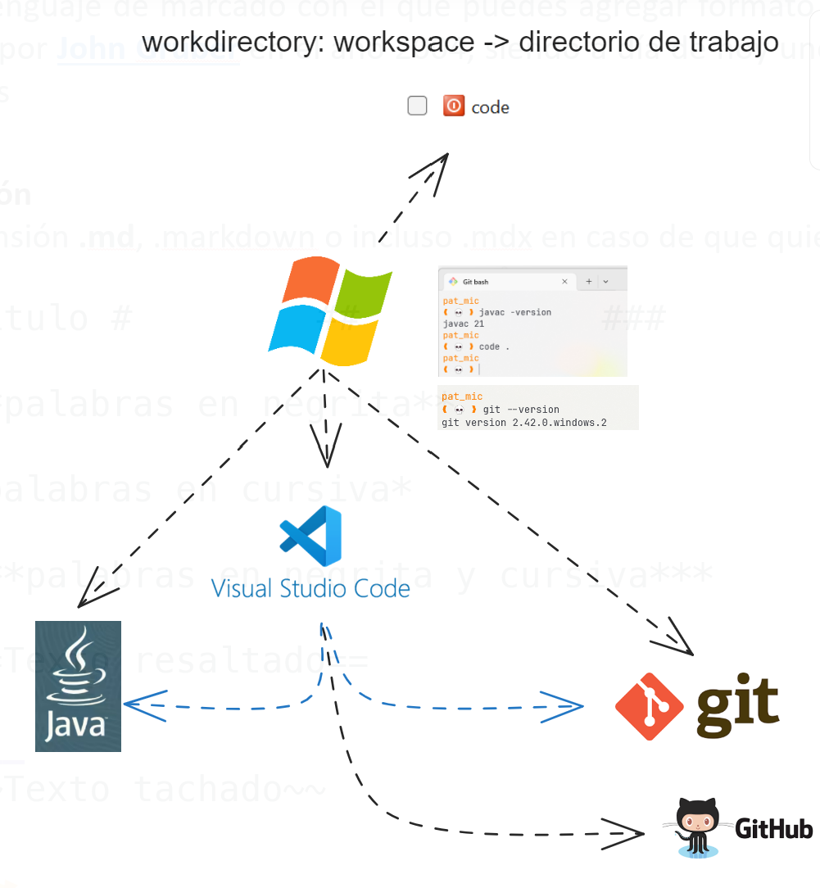

# primera clase
## IDE
0. instalar jdk
1. instalar gitbash
2. instalar el VSCODE
3. crear cuenta del github integrar al VSCODE instalar
4. jugar - mecanografia
5. extenciones para VSCODE (Extension Pack for Java)
6. consola-terminal: 
    - Windows Terminal Preview
    - https://ohmyposh.dev/
    - tipografica (JetBrains Mono, MesloLGL Nerd Font)
    - theme
    - icons

VSCODE(editor) ----> IDE java

--------------------------------------------
workdirectory: workspace -> directorio de trabajo
--------------------------------------
    date : 8.nov
# segunda clase

## top 10 CMD_VSCODE
1. abrir terminal en VSCODE
2. Command Palette:          CTRL+SHIFT+P
3. Quick Open:               CTRL+P 
4. Toggle Sidebar:           CTRL+B
5. Multi-Select Cursor :     CTRL+D,  CTRL+F2,  ALT+ SHIFT+ RATON
6. Copy Line:                SHIFT+ALT+UP or SHIFT+ALT+DOWN 
7. Comment Code Block:       SHIFT+ALT+A (Multi-line comment), CTRL+K+C (Single-line comment)  CTRL+K+U
8. Go back / move forward:   ALT+ —> or +
9. Trigger suggestion and Trigger parameter hints: Ctrl+Space, Ctrl+Shift+Space
10. line cut :              CTRL + X


#Markdown
--------

# titulo1
## titulo2
### titulo3


**palabras en negrita**

*palabras en cursiva*

***palabras en negrita y cursiva***

~~Texto tachado~~

...
[gogle](www.google.com)



<br>

este codigo java
```java
  public int Sumar(){
        int i=10;
        Integer.parseI
    }
```

este es codigo json
```json
{
  "firstName": "John",
  "lastName": "Smith",
  "age": 25
}
```

    date : 13.nov
# Quita clase

## GIT & Linux

Comandos para el uso del GIT

$ git --version
$ git config --global user.name "pat_mic"
$ git config --global user.email "pat_mic@hotmail.com"
$ git init
$ git status
    
----------   (On branch master)

$ git add <file.ext>
$ git add .

  
----<><><...>---  (On branch master)
     - roadmap.excalidraw
     - Hi.java
     - ...

$git commit -m "C1 prj-start"

                C1
----<><><...>---|--  (On branch master)
              35b936f


$ git add .gitignore 

----<><><...>---|------------------<> (On branch master)
              35b936f               - .gitignore

$  git commit -m "C2 add .gitignore "
                C1                    C2                C5
----<><><...>---|------------------<>-|---   ....   --- | (On branch master) 
              35b936f                43eab06

$ git rm read.pdf           (borrar archivo de la rama)
      


## branch + merge

----<><><...>---|---                  (main) ----<  (req / fix)
                |                        ^
                |             C1...      |
                |----<><><...>-|--    ...| *(Config)    
                               93fa79b


# Linux
$ clear
$ ctrl + l                        (arrow up)     (tab:  autocomplete)
$ cd /home/usuario/proyecto_git   (ingresar a los directorios)
$ ls -l                           (listar)
$ pwd                             (dir actual)
$ cat                             (ver el contenido del archivo, concatenar)
$ echo "hola" > file.txt          (crear un archivo y escribir en él)
$ touch                           (crear el archivo)